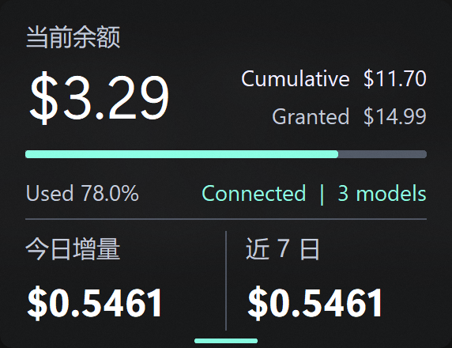

# wallet-monitor


一个轻量的 Windows 桌面钱包与 API 用量监视器：半透明毛玻璃、始终置顶、贴边自动收起。项目默认接入 **BUZZ**，但数据层与界面层是分开的，也可以改接其他余额、账单、配额或积分 API。



## BUZZ 是什么？

这里的 **BUZZ** 指 [buzzai.cc](https://buzzai.cc/) 提供的 AI 模型 API 服务。本项目使用用户自己的 BUZZ API Key，直接读取账户的额度、累计用量和可用模型列表，再把它们整理成桌面上的简洁卡片。

wallet-monitor 是独立的开源客户端，并非 BUZZ 官方项目，也不代表 BUZZ 的认可或背书。网络请求直接从你的电脑发往 `.env` 中配置的服务地址；本项目不提供中转服务器，也不会收集你的 Key。

## 能看到什么？

- 当前余额、累计消费、总额度与使用率
- 今日增量与近 7 日增量（根据本机采样计算）
- 可用模型数量与连接状态
- Windows Acrylic 毛玻璃和高 DPI 自适应
- 始终置顶、拖动、多显示器定位
- 拖到当前屏幕顶边后原地吸附并自动收起
- 双击立即刷新，右键刷新或退出

## 安装：只需要 Python

需要 Windows 10/11，以及 Python 3.8 或更高版本。下载项目后，在项目文件夹中打开终端，只执行：

```text
python setup_monitor.py
```

这个 Python 脚本会自动：

1. 在项目目录创建独立的 `.venv`；
2. 安装 `requirements.txt` 中的依赖；
3. 以隐藏输入方式询问 BUZZ API Key；
4. 把 Key 保存到不会上传 GitHub 的本地 `.env`。

如果当时不想输入 Key，直接按 Enter；脚本会生成一份 `.env` 模板，之后再编辑其中的这一行：

```dotenv
BUZZ_API_KEY=replace-with-your-key
```

其余设置均可选：

```dotenv
BUZZ_BASE_URL=https://buzzai.cc
BUZZ_REFRESH_SECONDS=300
BUZZ_CURRENCY_SYMBOL=$
```

## 启动

安装完成后执行：

```text
python run_monitor.py
```

`run_monitor.py` 会检查虚拟环境和 Key，然后在后台启动组件。遇到问题时，可让错误留在终端中：

```text
python run_monitor.py --foreground
```

不需要运行 `.cmd`、PowerShell 安装命令，也不需要手动激活虚拟环境。

## 操作

| 操作 | 效果 |
| --- | --- |
| 拖动窗口 | 移动到任意位置 |
| 双击窗口 | 立即刷新 |
| 拖到当前屏幕顶部 | 保持当前横向位置，吸附并自动收起 |
| 悬停顶部触发条 | 展开窗口 |
| 右键 | 刷新或退出 |

今日与近 7 日增量来自本机 `.wallet-monitor-history.json`。它只记录数值与时间，不记录 API Key，也只覆盖开始运行后的采样。

## 不只适用于 BUZZ

界面只消费一个标准化的“钱包快照”；BUZZ 的接口差异集中在 `load_config()` 和 `fetch_snapshot()`：

```python
{
    "granted": 15.0,      # 总额度
    "used": 11.5,         # 累计用量
    "balance": 3.5,       # 当前余额
    "model_count": 2,     # 可用模型或资源数量
}
```

要接入其他服务，可以保留整个窗口、历史采样和吸附逻辑，只替换配置读取与快照获取。例如：

```python
def fetch_snapshot(config):
    payload = get_json("https://api.example.com/v1/billing", config["api_key"])
    granted = float(payload["quota"])
    used = float(payload["spent"])
    return {
        "granted": granted,
        "used": used,
        "balance": max(0.0, granted - used),
        "model_count": len(payload.get("resources", [])),
    }
```

因此，它也能作为云服务余额、代理 API 额度、团队预算、积分池等 HTTP API 的桌面外壳。不同供应商的鉴权方式和字段名不同，接入时仍需要为对应 API 写一个小适配器。

## 灵感、依赖与我们做的改进

本项目不是下面任何项目的 fork，也没有把它们的界面代码拼接在一起；它们分别提供了库、平台能力或产品思路上的启发：

- [CustomTkinter](https://github.com/TomSchimansky/CustomTkinter)：现代化 Tkinter 控件、主题与缩放能力；wallet-monitor 直接使用它构建界面。
- [py-window-styles](https://github.com/Akascape/py-window-styles)：Python 调用 Windows 窗口样式的思路与兼容回退；项目将它作为 Acrylic 失败时的后备方案。
- [TrafficMonitor](https://github.com/zhongyang219/TrafficMonitor)：用一个轻量、常驻且一眼可读的小窗口展示实时数据的产品思路。
- [Windows App SDK Samples](https://github.com/microsoft/WindowsAppSDK-Samples)：Windows 11 Backdrop / Acrylic 的系统视觉方向。当前实现直接调用 Windows 的 DWM 与窗口合成接口，以保持这个小工具足够轻。

在这些思路之上，wallet-monitor 针对 API 钱包监视做了这些工作：

- 把供应商 API 与 UI 隔离成统一的四字段快照，默认支持 BUZZ，也保留其他 API 的接入口；
- 不部署后台服务，Key 和历史都只留在本机；
- 用本地采样补出“今日”和“近 7 日”用量，而不要求供应商额外提供日报接口；
- 针对多显示器和不同 DPI 修正拖动、置顶、贴边吸附及“保持原横坐标收起”；
- 结合原生 Acrylic、圆角和兼容回退，减少普通 Tkinter 悬浮窗的厚重边框感；
- 提供纯 Python 的安装与启动入口，不要求用户理解批处理脚本。

感谢这些开源项目的作者。本仓库只按各自公开接口使用依赖；更多许可信息请查看它们各自的仓库。

## 项目文件

```text
wallet-monitor/
├─ wallet_monitor.py       # UI、历史记录与默认 BUZZ 适配器
├─ setup_monitor.py        # 用 Python 创建环境、安装依赖并配置 Key
├─ run_monitor.py          # 用 Python 检查配置并启动组件
├─ requirements.txt
├─ .env.example            # 不含真实 Key 的配置模板
└─ docs/screenshot.png     # 实际使用效果图
```

## 安全

- `.env`、虚拟环境、本地历史和窗口位置均已加入 `.gitignore`；
- 安装脚本使用隐藏输入，不会把 Key 回显到终端；
- 请勿在 Issue、截图或日志中粘贴真实 API Key；
- 推荐使用权限尽可能小、可随时撤销的 Key；
- 发布前仍应检查 `git status`，确认 `.env` 没有被暂存。

## License

本项目采用 [MIT License](LICENSE)。第三方依赖与参考项目使用各自的许可证。